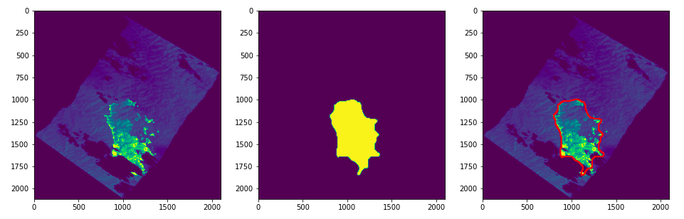

# Challenge 1 : Fire mapping - EY
## Ordronneau Luca - Reberga Louis - Moncoutie Johan - Ettarian Julian
### Segmentation



### Project Architecture :

```
Challenge 1 : Fire mapping - Ordronneau - Reberga - Moncoutie - Ettarian
│   README.md
│   challenge1-report.pdf (english)
│   challenge1-presentation.pptx (english)  
│   challenge1-video-abstract.mp4 (english)
│   fiche_synthetique.pdf (french)
│
└─── code
    │   data.ipynb
    │   InceptionResnetV2.ipynb
    |   test_model.ipynb
    │
    └─── submission
    |   │   InceptionResNetV2...ellipse.csv
    |
    └─── model
    │   │   InceptionResNetV2_413_semi_final.h5
    |
    └─── data
    │   │   X_Y_TRAIN_413_semi_final.npz
    │   │   X_TEST_413_semi_final.npy

```

`code` : Folder with all code files as well as data, model...
- `data.ipynb` : Construction of the dataset (polygon and linescan matches, pre processing)
- `InceptionResNetV2.ipynb` : Creation of the model and first display of predictions.
- `test_model.ipynb` : Testing the model with morphological operations just before creating the submission file.
- `model` : Folder for the test model
    - `InceptionResNetV2_413_semi_final.h5` : Model
- `data` : Folder for dataset
    - `X_Y_TRAIN_413_semi_final.npz` : Training data
    ```
    import numpy as np
    data = np.load('X_Y_TRAIN_413_semi_final.npz')
    X_train = data['a']
    Y_train = data['b']
    ```
    - `X_TEST_413_semi_final.npy` : Testing data
    ```
    import numpy as np
    X_test = np.load('X_TEST_413_semi_final.npy')
    ```
- `submission` : Folder for submission file
    - `InceptionResNetV2_413_semi_final_open_3_iter_1_close_16_iter_1_0_1_ellipse.csv` : CSV file example for submission
